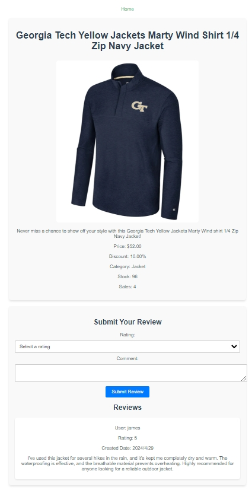
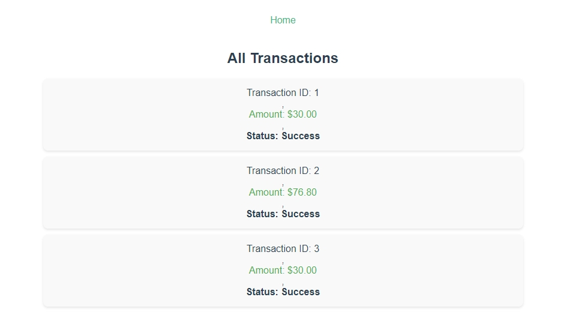

# QuintShop v0.1

QuintShop is a full-stack e-commerce platform featuring a Vue.js frontend and a Django backend. This project is designed to provide a comprehensive system for managing products, orders, and user interactions on an e-commerce website.

## Quick Demo

### Customer-side Views:
<p align="center">

</p>

<p align="center">

</p>

<p align="center">

</p>

### Admin-side Views:

<p align="center">

</p>

<p align="center">

</p>

<p align="center">

</p>

<p align="center">

</p>

## Components Overview

### Frontend

The frontend of QuintShop is built with Vue.js. It uses Vue Router for app routing and organizes its functionality across components dedicated to different aspects of the e-commerce experience:

* **User Authentication:**
  - `UserLogin.vue`: Manages user login processes.
  - `UserRegister.vue`: Handles new user registrations.

- **Product Management:**
  - `ViewProductList.vue`: Displays a list of products available for purchase.
  - `ViewProductDetail.vue`: Provides detailed views of individual products, including descriptions, prices, and other relevant details.

- **Order Management:**
  - `PlaceOrder.vue`: Enables the placement of orders by users.
  - `OrderManagement.vue`: Used by customers to track their order history.

- **Admin Management:**
  - `AdminPage.vue`: The dashboard for administrators to oversee site operations.
  - `AdminProductManagement.vue`: Allows admins to add, edit, or remove products from the catalog.
  - `AdminOrderManagement.vue`: Enables admins to view and manage orders placed by users.
  - `AdminSupportTicketsManagement.vue`: Admin interface for managing customer support tickets.
  - `AdminTransactionsManagement.vue`: View transaction records.

- **Support and Customer Service:**
  - `SupportTicketsManagement.vue`: Component for users to create and track support tickets.

- **Routing and Navigation:**
  - Managed through `src/router/index.js`, which defines all the routes for the application.

### Backend

The backend of QuintShop is developed using Django. Here’s a breakdown of the backend components:

- **Django Project Configuration:**
  - `backend/quintshop/settings.py`: Configuration for the Django project, including database configurations, security settings, and third-party app integrations.
  - `backend/quintshop/urls.py`: Defines the URL routes for the entire backend, directing incoming HTTP requests to the appropriate views.

- **Application Components:**
  - `backend/shop`: This is the main app within the Django project.

- **Database Models:**
  - `backend/shop/models.py`: Contains the database schema models that Django ORM uses to create the database tables.

- **API Views and Controllers:**
  - `backend/shop/views.py`: Defines the logic to handle requests and generate responses. Uses Django's views to process data and send it back to the frontend.
  - `backend/shop/serializers.py`: Responsible for converting complex data types, such as querysets and model instances.

- **Admin Interface:**
  - `backend/shop/admin.py`: Configures the built-in Django admin interface to enable administrators to edit, delete, and manage the application data directly from a web-based interface.

- **Database Migrations:**
  - `backend/shop/migrations/`: Contains all migrations files which are auto-generated by Django to keep track of changes to the database schema.

- **Testing:**
  - `backend/shop/tests.py`: Holds tests for the shop application to ensure the backend functions correctly and expected behaviors are met.

- **API Routing:**
  - `backend/shop/urls.py`: Specific URL configurations for the shop application, defining endpoints such as product list, product detail, and order creation.

## Project Setup

### Frontend Setup

1. **Prerequisites:**
   - Install [Node.js](https://nodejs.org/) which includes npm (Node Package Manager).

2. **Installing Dependencies:**
   - In root directory, run following:
     ```bash
     npm install
     ```

3. **Running the Development Server:**
   - To run the frontend in development mode with hot reload at localhost, execute:
     ```bash
     npm run serve
     ```

4. **Building for Production:**
   - To compile and minify the frontend for production, use:
     ```bash
     npm run build
     ```

5. **Linting and Fixing Files:**
   - To lint and automatically fix any code issues in the project, run:
     ```bash
     npm run lint
     ```

### Backend Setup

1. **Prerequisites:**
   - Ensure Python is installed on your system. The backend is compatible with Python 3.6. You can download Python from [here](https://www.python.org/downloads/).

2. **Setting Up the Database:**
   - Make migrations and migrate the database schema under `backend\` directory with:
     ```bash
     python manage.py makemigrations
     python manage.py migrate
     ```

4. **Running the Development Server:**
   - Start the Django development server:
     ```bash
     python manage.py runserver
     ```
   - This will serve the backend at `localhost:8000`.

5. **Admin Panel:**
   - To create a superuser for accessing the Django admin panel:
     ```bash
     python manage.py createsuperuser
     ```
   - Follow the prompts to set up the superuser account. Once created, navigate to `localhost:8000/admin` to access the backend admin panel.

### Customizing Configurations

- **Vue Configuration:**
  - Customize Vue settings by modifying the `vue.config.js` file or referring to the [Vue CLI Configuration Reference](https://cli.vuejs.org/config/).

- **Django Settings:**
  - Backend settings can be adjusted in `backend/quintshop/settings.py`, including database configurations, security settings, and third-party app integrations.

---
